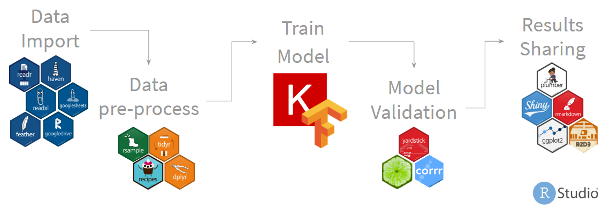
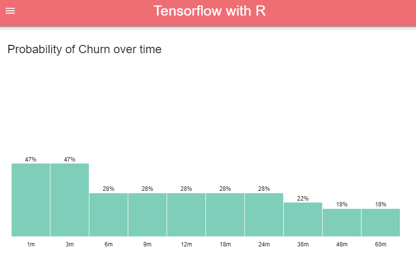
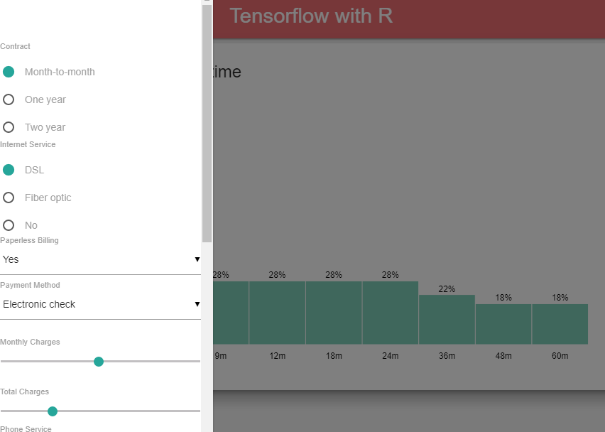
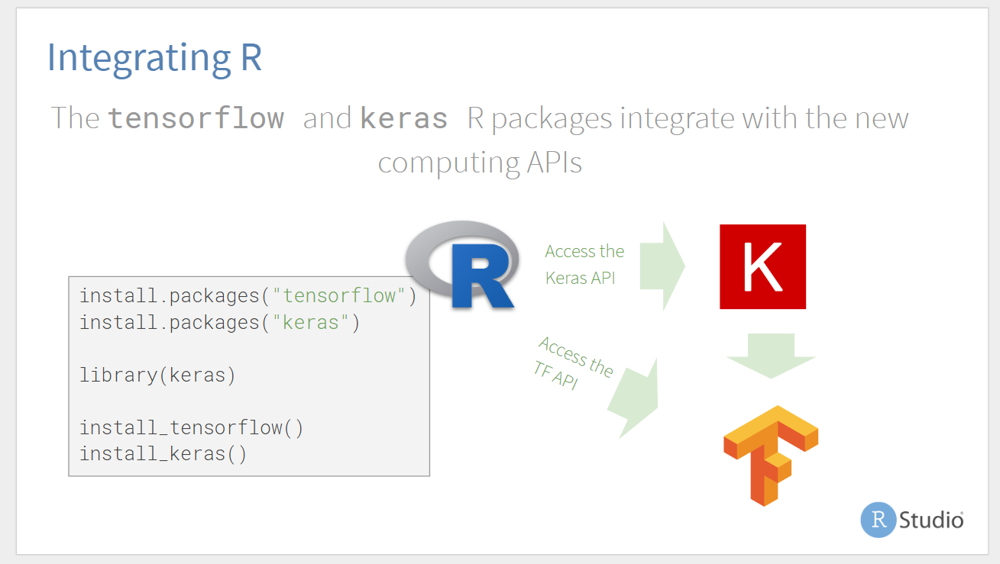
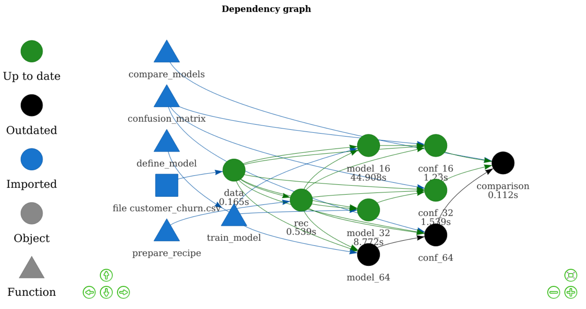

Tensorflow with R
======================================================

## Contents

### R Notebook

R document that details the process of creating and deploying the model.  

- Copy published to RStudio Connect: http://colorado.rstudio.com/rsc/content/1553/tensorflow-w-r.nb.html

### Exported Keras/Tensorflow model

A folder that contains a Keras Neural Network model developed, and created in the R Notebook.  The resulting files are Tensorflow, not R.  The main file is a [Protocol Buffer](https://developers.google.com/protocol-buffers/?hl=en)

The model was also deployed to RStudio Connect and can be found here: http://colorado.rstudio.com/rsc/connect/#/apps/2230/access

### Shiny app

Source code for the Shiny application that uses the deployed Keras model in RStudio Connect as its source.  It uses `shinymaterial` to make it more mobile-friendly.

- Deployed app on RStudio Connect: http://colorado.rstudio.com/rsc/churn/overtime/
- Short link to the same app: http://rstd.io/churn

### Presentation 

Companion presentation deck in PDF format: https://github.com/sol-eng/tensorflow-w-r/blob/master/presentation/tensorflow-w-R.pdf

### Automated workflow

An example of how to automate the workflow using the `drake` package is in the **workflow** folder. 

- Published R Notebook: http://colorado.rstudio.com/rsc/content/2159/tensorflow-drake.nb.html

